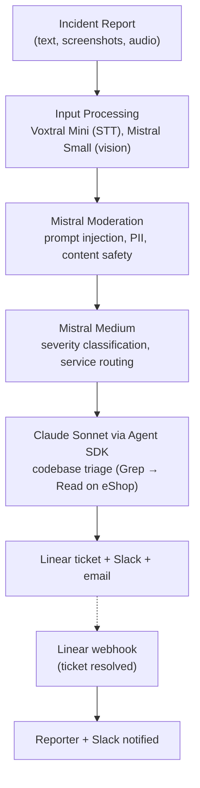

# SRE Incident Intake & Triage Agent

AI-powered incident triage for the [dotnet/eShop](https://github.com/dotnet/eShop) e-commerce platform. Accepts text, screenshots, and audio. Analyzes the codebase. Creates tickets. Notifies the team.

Built for the SoftServe AgentX Hackathon 2026.

## Overview

SRE teams waste hours on incident triage. Reports arrive vague, engineers search codebases for context manually, and information gets lost between tools. The gap between "something is broken" and "here's what to investigate" takes too long.

This agent closes that gap. It receives incident reports through a web UI, screens them for prompt injection, classifies severity, then uses Claude with tool access to search and read the actual eShop source code. The output is a structured analysis: root cause hypothesis, affected files (validated to exist), investigation steps, and a suggested fix. A Linear ticket is created, Slack and email notifications go out, and when the ticket is resolved, the reporter is notified automatically.

Five models handle the pipeline, each picked for its specific task instead of routing everything through one expensive model. Audio transcription runs on Voxtral Mini. Image analysis uses Mistral Small. Guardrails use Mistral Moderation's 11-category classifier (free). Classification goes through Mistral Medium with JSON mode. Deep codebase reasoning uses Claude Sonnet with Agent SDK tool use. Measured cost per incident: ~$0.007. Real numbers in [SCALING.md](SCALING.md).

## Architecture



Every stage streams progress to the frontend via SSE. The reporter sees each step execute in real time.

## Pipeline

| Step | Model | ~Cost/call | Purpose |
|------|-------|-----------|---------|
| Audio transcription | Voxtral Mini | < $0.001 | Dedicated 3B STT model (when audio attached) |
| Image analysis | Mistral Small | < $0.001 | Screenshot and error dialog description (when images attached) |
| Guardrails | Mistral Moderation | Free | 11 categories including prompt injection and PII |
| Classification | Mistral Medium | ~$0.001 | Severity (P0-P3), category, affected services, search paths |
| Codebase triage | Claude Sonnet 4.6 | ~$0.007 | Agent SDK with Read/Glob/Grep scoped to eShop |
| Ticket + notifications | f-string templates | $0 | Deterministic formatting, no LLM needed |

## Key Decisions

**Context engineering.** A pre-built service map (generated at Docker build time) scopes Claude's search to affected services only. The classification step outputs `search_paths` that constrain the triage agent. Grep runs first, Read only on relevant hits (max 5 file reads). Every file path in the output is validated against the repo. When a duplicate incident is detected, the prior triage result is injected as an unverified hypothesis to give the agent a head start.

**5-layer security.** Mistral Moderation pre-screens all input (11 categories, fail-closed). Inline guardrails on classification add a second checkpoint at zero extra latency. `[USER_INPUT_START/END]` boundary markers wrap user text in the Claude prompt. Server-side path restriction locks tool calls to the eShop directory (not prompt-based). HMAC-SHA256 webhook verification with timing-safe comparison and 60-second replay protection. Evidence in [AGENTS_USE.md](AGENTS_USE.md).

**Real integrations.** Linear (GraphQL API), Slack (incoming webhook with Block Kit), Resend (email). No mocks. Each call retries with exponential backoff via `stamina`.

**Graceful degradation.** Every pipeline stage is independently fenced. Ticket creation failure does not block notifications. Notification failure does not block triage results. The reporter always sees the output.

**Observability.** Auto-instrumented distributed traces via OpenInference (Claude Agent SDK, Anthropic, Mistral). Manual OTel spans for moderation and Voxtral transcription. Structured JSON logs via `structlog` with trace_id correlation. Per-model token and cost tracking. All visible in Arize Phoenix at `:6006`.

## Project Structure

```
├── backend/                   # FastAPI + Claude Agent SDK (see backend/README.md)
│   ├── app/                   # Application modules
│   ├── tests/                 # 140 tests (38 files)
│   └── scripts/               # eShop map generator (runs at Docker build)
├── frontend/                  # Next.js + shadcn/ui (see frontend/README.md)
│   ├── src/                   # Components, hooks, pages
│   └── e2e/                   # Playwright smoke tests
├── docker-compose.yml         # phoenix, backend, frontend, cloudflared
├── .env.example               # All required env vars with comments
├── QUICKGUIDE.md
├── AGENTS_USE.md
├── SCALING.md
└── LICENSE
```

## Documentation

| Document | Contents |
|----------|----------|
| [QUICKGUIDE.md](QUICKGUIDE.md) | Clone, configure, run. Step-by-step setup |
| [AGENTS_USE.md](AGENTS_USE.md) | Agent capabilities, context engineering, observability and security evidence |
| [SCALING.md](SCALING.md) | Cost per incident, latency breakdown, scaling assumptions |

## Getting Started

See [QUICKGUIDE.md](QUICKGUIDE.md).

## License

[MIT](LICENSE)
